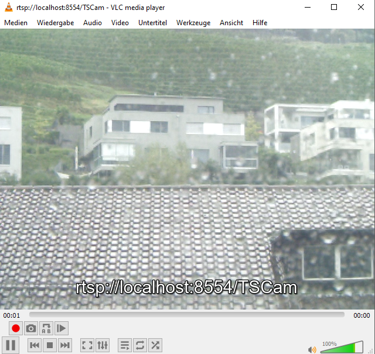

# Setup Video Stream
This example is about creating a RTSP video stream form a video file.

## Required Software

### RTSP Server
[rtsp-simple-server](https://github.com/aler9/rtsp-simple-server) is a ready-to-use and zero-dependency server and proxy 
that allows users to publish, read and proxy live video and audio streams through various protocols. You can download 
the newest release [here](https://github.com/aler9/rtsp-simple-server/releases).

Just start the executable without a parameter and the server runs until you close it.

### ffmpeg
[ffmpeg](https://ffmpeg.org/) could be used to publish a stream from an existing video. You can download a Windows
version [here](https://www.gyan.dev/ffmpeg/builds/) (ffmpeg-release-essentials.zip).

#### Usage
To stream a recoded example video form a TotalStation in a loop you can use following parameters
```
  ffmpeg -re -stream_loop -1 -i TSCam.mp4 -an -c copy -f rtsp rtsp://127.0.0.1:8554/TSCam
```  
The RTSP URI (`rtsp://127.0.0.1:8554/TSCam`) is used by the Captivate Simulator to receive the video 
stream (hardcoded).

To play any video you need the `h264` encoder, a video size of `640:480`, the pixel format `yuvj420p` and extra data activated. The ffmpeg call would look like this
```
  ffmpeg -re -stream_loop -1 -i TSCam.mp4 -an -c:v h264 -vf scale=640:480 -pix_fmt yuvj420p -bsf:v dump_extra -f rtsp rtsp://127.0.0.1:8554/TSCam
```

### VLC Player
Instead of the Captivate Simulator you can use the [VLC Player](https://www.videolan.org/vlc/index.en.html) to 
receive the streamed video.



## Folder content
| File | Description |
| ---- | ----------- |
| TSCam.mp4 | recorded video from a real TotalStation |
