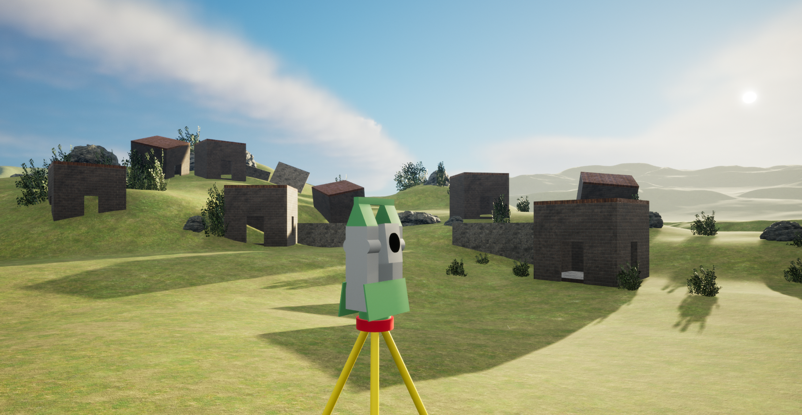

# Virtual Environment
This file contains the documentation of the virtual environment, which is provided as a potential starting point together with some hints on how it can be connected to the Leica Captivate TS_MS simulator. 

## Setup and Features

### Setup
The virtual environment is based on the https://www.unrealengine.com/[Unreal Engine 5] and can be downloaded https://hexmet-my.sharepoint.com/:u:/g/personal/luca_varano_leica-geosystems_com/ET4O5hVYk89JhliZFVkv4W4BhgmFhPFk05DvZyXcsHVoBg?e=etv6df[here]. To setup the project the following steps have to be executed:

1. Extract the .zip folder
2. Start the unreal engine and open the extracted folder as a project
3. Go to *File > Open Level* and open the *DemoMap* level. Now the same environment as in the image below should be shown:

image::images/virtual_environment.png[]

### Features
The main feature implemented in the virtual environment is the controllable TotalStation:

1. To start the execution of the virtual environment click on the green play button
2. After a short loading phase the execution will start and the perspective of the scene changes
3. Use the mouse to click somewhere in the window to enable the mouse and keyboard inputs
4. Now the Totalstation can be controlled by pressing the following keys on the keyboard:

|===
| Key (pressed) | Event
| J | Rotate to the left
| L | Rotate to the right
| I | Rotate Telescope upwards
| K | Rotate Telescope downwards
|===

[start=5]
5. Each time when a key is released (i.e. the TotalStation stops rotating) a rendered image from the perspective of the TotalStation's camera is stored. This image can be found in <Your_Project_Root_Folder>/Saved/CameraOutput.png

The featues described above are implemented in the TotalStation Blueprint, which can be found in StarterContent/Blueprints/TotalStations in the Content Drawer.

## Implementation Hints
* To stream a video within the Leica Captivate TS_MS simulator a https://en.wikipedia.org/wiki/Real_Time_Streaming_Protocol[RTSP Stream] is needed. This stream could for example be generated by implementing a buffer for the TotalStation's camera images and combining them to an artifical stream.

* It is also possible to play in the virtual environment directly from the TotalStations perspective. This can be done by using the *Set View Target with Blend* feature in the Blueprint. (Note: You might need to move the *SceneCaptureComponent2D* as it overlaps with the TotalStation's camera perspective)

* The field of view of the TotalStation camera (overview camera with zoom factor 1) is  15.568° horizontal and 11.708° vertical
