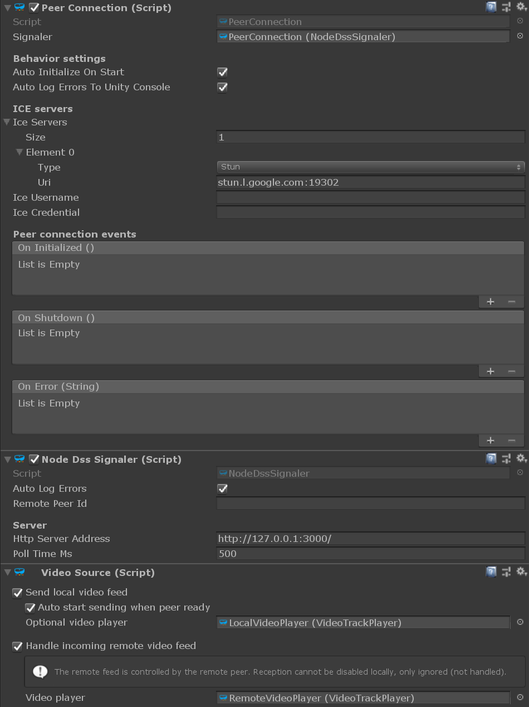
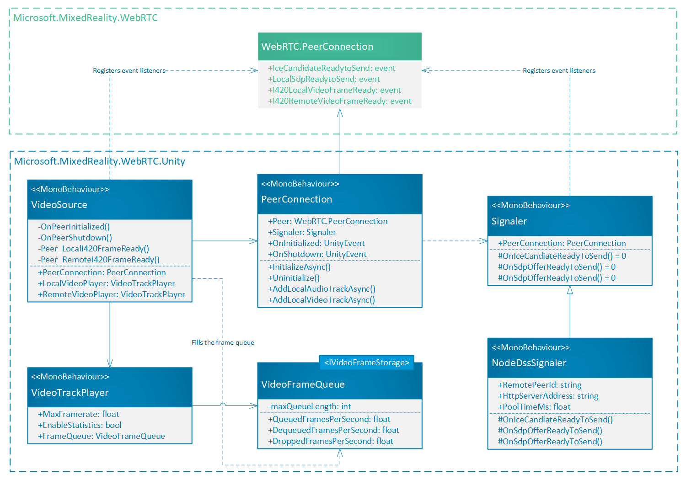

# Unity components

The Unity components provide some idiomatic wrapping over the C# MixedReality-WebRTC library.

| **Component** | **Description** |
|-|-|
| PeerConnection | Encapsulates a single peer-to-peer connection to a remote peer |
| Signaler | Abstract base class of components which manage the signaling messages to allow the peer connection to establish |
| NodeDssSignaler | Simple testing / debugging Signaler implementation component based on [node-dss](https://github.com/bengreenier/node-dss) |
| VideoSource | Component providing a hook to the local and remote video tracks of a peer connection |
| VideoTrackPlayer | Component bridging a Unity [MeshRenderer](https://docs.unity3d.com/ScriptReference/MeshRenderer.html) with a video track from a VideoSource component |

## Components by feature area

### Connection

The most important component is `Microsoft.MixedReality.WebRTC.Unity.PeerConnection` which encapsulate the connection to a single remote peer. The peer connection works in coordination with a `Signaler` component, for example `Microsoft.MixedReality.WebRTC.Unity.NodeDssSignaler`, which handles the message transport for the session establishment.

### Video

The entry point for video tracks is the `VideoSource` component, which is associated with a given `PeerConnection` and handles its video-related signals. The video source in turn makes use of one or two `VideoTrackPlayer` to render the content of the local and remote video tracks if needed, although this is optional.

Video frames are provided by the underlying `WebRTC.PeerConnection` to the `VideoSource` via its frame events. The video source then fills a `VideoFrameQueue` for each video track player associated with it. The player use that shared queue to read back the frame and display it using a custom shader.

### Audio

Todo...

## List of components

### `Microsoft.MixedReality.WebRTC.Unity.PeerConnection`

This component abstracts a WebRTC peer connection and encapsulates the lower level `Microsoft.MixedReality.WebRTC.PeerConnection` object from the C# library. This is the main entry point for establishing a connection. It contains the list of ICE servers ([Interactive Connectivity Establishment](https://tools.ietf.org/html/rfc5245)) used to punch through NAT, as well as some key events like `OnInitialized` and `OnShutdown` which mark the beginning and end of the connection from the point of view of the user.

### `Microsoft.MixedReality.WebRTC.Unity.Signaler`

This abstract base component is used by the peer connection to establish a connection with a remote peer. The peer connection needs one concrete implementation derived from this class to be specified in its `Signaler` property.

### `Microsoft.MixedReality.WebRTC.Unity.NodeDssSignaler`

THIS SHOULD NOT BE USED FOR PRODUCTION.

This components is used for debugging and testing as a concrete implementation of a `Signaler` component. It is based on the [node-dss](https://github.com/bengreenier/node-dss) protocol and NodeJS service. It is very simple and helps developers starting, but lacks many features.

### `Microsoft.MixedReality.WebRTC.Unity.VideoSource`

This component controls sending the local video track through the peer connection, and handles receiving a remote video track.

- For the local video, it controls whether or not a track is added to the WebRTC stream, and optionally provides a `VideoTrackPlayer` with frames to render that local video.
- For the remote video, it controls whether or not to handle the received feed and send it to a `VideoTrackPlayer` for rendering. Note that the local peer cannot control whether or not the remote peer sends a remote track; it can only ignore it if not interested (and ideally should probably tell the remote peer that it should stop sending it, although this is application specific logic).

### `Microsoft.MixedReality.WebRTC.Unity.VideoTrackPlayer`

This components bridges a raw video frame feed from a `VideoSource` to a Unity `MeshRenderer` for display. The component can limit the framerate of the video playback, and optionally display some statistics about it. The associated `MeshRenderer` on the same `GameObject` typically uses a `YUVFeedMaterial` to display the YUV-encoded feed uploaded to the main texture of that material by the video track player component.
